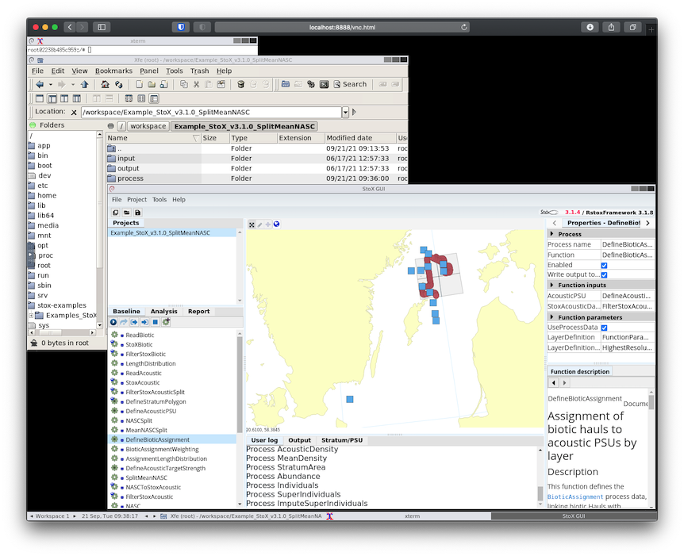

# StoX in a Box

This is an implementation of the [StoX GUI](https://stoxproject.github.io/StoX/) 
application in Docker. A full-pledged
VNC server (TigerVNC) and a browser-based VNC client (noVNC) are included
as well so you can have StoX up and running remotely from any Linux servers.

## Screenshot


## Running

### Direct connection to server

On the server:
```console
$ docker run --rm -it -p 8080:8080 iambaim/stox-remote
```

Open a browser on your machine and see the StoX GUI at `http://<server>:8080/vnc.html`

### Tunelling the server port via SSH

Sometimes the server ports are blocked by the administrator. If you have
access to SSH you can do a port forwarding to get around the restriction.

> Below is assuming that you will use the server port **8888**. Using any other
ports are possible too.

On your **local machine** (Linux/MacOS):
```console
$ ssh -L 8888:localhost:8888 <user>@<server>
```

After connected run the following command on **the server**:
```console
$ docker run --rm -it -p 8888:8080 iambaim/stox-remote
```

Open a browser on your machine and see the StoX GUI at `http://localhost:8888/vnc.html`

### Persistent data storage

You might want to use a persistent data storage to ensure your StoX project files
are preserved after you destroy the Docker container.

```console
$ mkdir -p /home/<user>/stox-workspace
$ docker run --rm -it -p 8888:8080 -v /home/<user>/stox-workspace:/workspace:Z iambaim/stox-remote
```

# Thanks
This work is based on the novnc container by @theasp: https://github.com/theasp/docker-novnc

